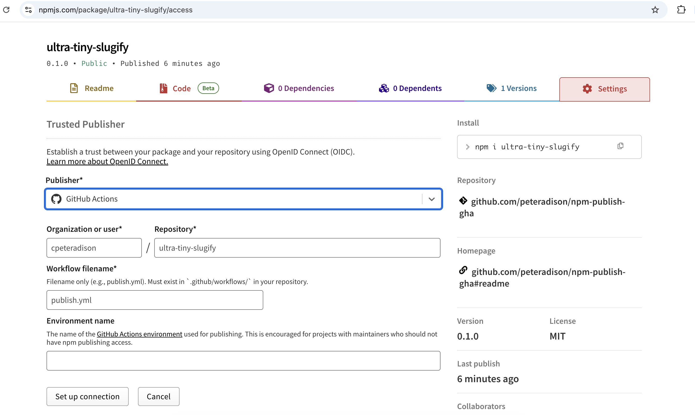

# GitHub Actions npm Publish Workflow

Generic GitHub Actions workflow for publishing npm packages with trusted publishing.

## Quick Start

1. Copy [`./.github/workflows/publish.yml`](./.github/workflows/publish.yml) into your repo.
2. Edit the `env:` values in the workflow for your project layout.
3. Run your build locally and confirm the publish folder is correct.
4. Run the workflow from GitHub Actions.

## Run Inputs

- `dist_tag`: `latest`
- `npm_access`: `public`
- `push_git_tag`: `true`

## Before You Use It

Make sure your project has:

- an npm package ready to publish
- GitHub Actions enabled for the repository
- npm trusted publishing configured for the repository on npm

Make sure your publish target has:

- a folder to publish from, such as `dist/` or `.`
- a valid `package.json` in that folder, such as `dist/package.json` if you publish from `dist/`

## First Release

Publish once with normal npm credentials before switching this package to trusted publishing.

<details>
<summary>Show first-release steps</summary>

Build the package, log in to npm, and publish once with normal credentials:

```bash
npm run build
npm login
npm publish ./dist
```

If the package is scoped and public, use:

```bash
npm publish ./dist --access public
```

After the first publish, add the GitHub repository as a trusted publisher on npm and use the GitHub Actions workflow for future releases.

Reference screenshot for the npm trusted publisher setup:



</details>

## What You Edit Once

Update the `env:` block near the top of the workflow for your repo:

- `PUBLISH_PATH`
- `PACKAGE_JSON_PATH`
- `NODE_VERSION`
- `REGISTRY_URL`
- `INSTALL_COMMAND`
- `BUILD_COMMAND`
- `TEST_COMMAND`
- `GIT_TAG_PREFIX`

The workflow checks:

- `PUBLISH_PATH` exists
- `PUBLISH_PATH/package.json` exists
- `PACKAGE_JSON_PATH` exists and contains the version to tag

## Default Config

- `PUBLISH_PATH`: `dist`
- `PACKAGE_JSON_PATH`: `src/package.json`
- `NODE_VERSION`: `24`
- `REGISTRY_URL`: `https://registry.npmjs.org`
- `INSTALL_COMMAND`: `npm ci`
- `BUILD_COMMAND`: `npm run build --if-present`
- `TEST_COMMAND`: `npm test`
- `GIT_TAG_PREFIX`: `v`

These defaults assume source metadata in `src/` and publish output in `dist/`.

## Example Layout

```text
.
├── src/
│   ├── index.js
│   ├── package.json
│   └── README.md
├── dist/
├── test/
├── .github/workflows/ci.yml
└── .github/workflows/publish.yml
```

See [`./src/`](./src/) for the sample package and [`./src/README.md`](./src/README.md) for package usage.

## License

MIT
